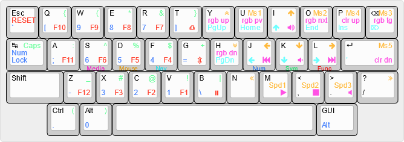

This layout was inspired by the [Miryoku layout](https://github.com/qmk/qmk_firmware/tree/master/users/manna-harbour_miryoku).

I had to modify the Miryoku layout for this board since unlike the 6 thumb keys in the Miryoku, I wanted to try using a full-sized spacebar on this board. The transition wasn't too difficult, but the placement of the numpad 'dot' and 'zero' are a little bit awkward.

Use the included [keyboard-layout-editor_daisy40.json](files/keyboard-layout-editor_daisy40.json) file on [keyboard-layout-editor.com](http://www.keyboard-layout-editor.com) to edit the layout shown above.

The instructions for this board on [KPREPUBLIC](https://kprepublic.com/collections/pcb/products/daisy-40-custom-keyboard-pcb?_pos=2&_sid=15de7ce2c&_ss=r) suggest using [ydkb.io](https://ydkb.io/) to create and build the firmware, which I found is unnecessary. What is necessary, though is to download the reflash tool since the QMK boot loader isn't natively installed on this board. (It can be installed by [ISP Flashing](https://docs.qmk.fm/#/isp_flashing_guide) it, which is apparently a very complex process which may require special tools.) After downloading the tool from ydkb.io ([I have included Ver.20200306 demo version](files/YDKBs-reflash.zip), which worked for me) click on 'Choose Firmware', select the QMK firmware you wish to flash, click 'Reflash', then follow the instructions. This will flash QMK firmware without the need to ISP Flash the QMK boot loader. A VIA .hex is also available for the Daisy if that is more convenient.

A pre-compiled QMK .hex file and a pre-compiled YDKB .hex file of this firmware have also been included in the files directory.

Created by [Ross Nelson](https://rossnelson.me)
