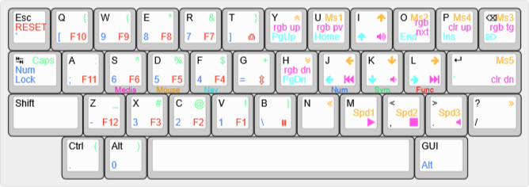

This layout was inspired by the [Miryoku layout](https://github.com/qmk/qmk_firmware/tree/master/users/manna-harbour_miryoku).

This is a recreation of my [Daisy40 layout](https://github.com/Rossmallow/Custom-Keyboard-Firmware/tree/master/daisy/ross).
Since getting the Daisy40, it has become one of my favorite boards, but I've had two PCBs from kprepublic die on me. It's been a while since I've been able to use the board, and in that time, kprepublic no longer offer the PCB on their website (although I guess it's available on Aliexpress). I've had bad luck with those boards, though, and the mini USB port is very outdated at this point. Someone on the 40% Keyboards Discord server pointed me to this DSP40 from Keebio.
After some struggle with relearning qmk and realizing that since I last coded a keymap, many of the key codes have changed, I finally got the firmware compiled.

Per usual, A pre-compiled QMK .hex file is included in the files directory.

Created by [Ross Nelson](https://rossnelson.me)
