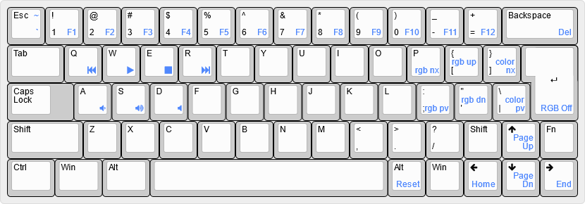

This layout was originally designed for use with the retro style Saturn 60 case.
I had never tried a board with an ISO enter before and thought that this would be a good time to.
The layout of the board is pretty standard With all of the standard keys on the first layer and some additional function and media keys on the second layer.

Use the included [keyboard-layout-editor_dz60.json](files/keyboard-layout-editor_dz60.json) file on [keyboard-layout-editor.com](http://www.keyboard-layout-editor.com) to edit the layout shown above.
A pre-compiled .hex file of this firmware has also been included in the files directory.

Created by [Ross Nelson](https://rossnelson.me)