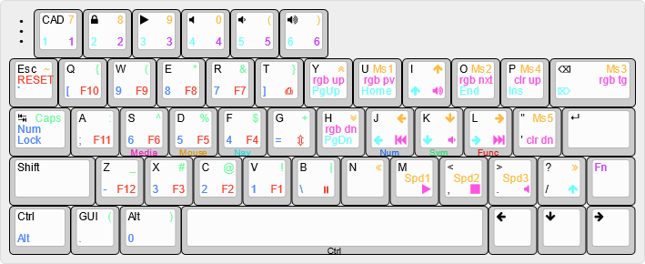

This layout was inspired by the [Miryoku layout](https://github.com/qmk/qmk_firmware/tree/master/users/manna-harbour_miryoku).

For this board, I used practically the same layout as my [Daisy40 build](../../daisy/ross/README.md) with slight modifications since this board has about 10 more keys than the Daisy.

Use the included [keyboard-layout-editor_v4n4g0n.json](files/keyboard-layout-editor_v4n4g0n.json) file on [keyboard-layout-editor.com](http://www.keyboard-layout-editor.com) to edit the layout shown above.

[TheVanKeyboards.com](https://qmk.thevankeyboards.com/) has a QMK configurator and compiler on their website. Since the V4N4G0N isn't in the QMK repository, to get the default files, you will first have to go here, build firmware, and download the zip file. Then, unzip it and put the contents of the file into 

```
/path/to/qmk_firmware/keyboards/
```

so that it can compile. After that, you can edit the files as normal.
What I did, do make the editing a bit easier was to first make as many changes as I could on the website and then edit the file after. I included the [V4N4G0N.json](files/V4N4G0N.json) and the [V4N4G0N.zip](files/V4N4G0N.zip) files generated by that website that I used as a starting point.

A pre-compiled QMK .hex file generated by qmk.thevankeyboards.com ([V4N4G0N_default.hex](files/V4N4G0N_default.hex)) and a pre-compiled QMK .hex file compiled by me ([v4n4g0n_ross.hex](files/v4n4g0n_ross.hex)) have also been included in the files directory.


Created by [Ross Nelson](https://rossnelson.me)
